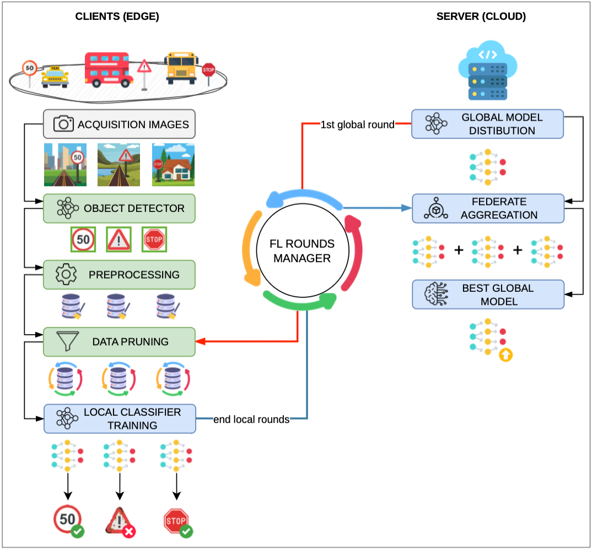
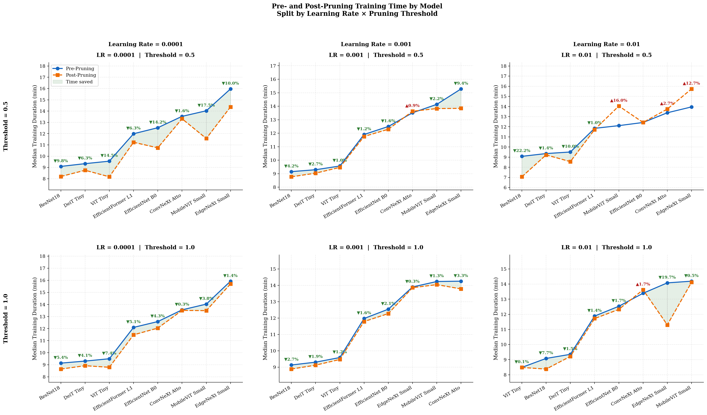
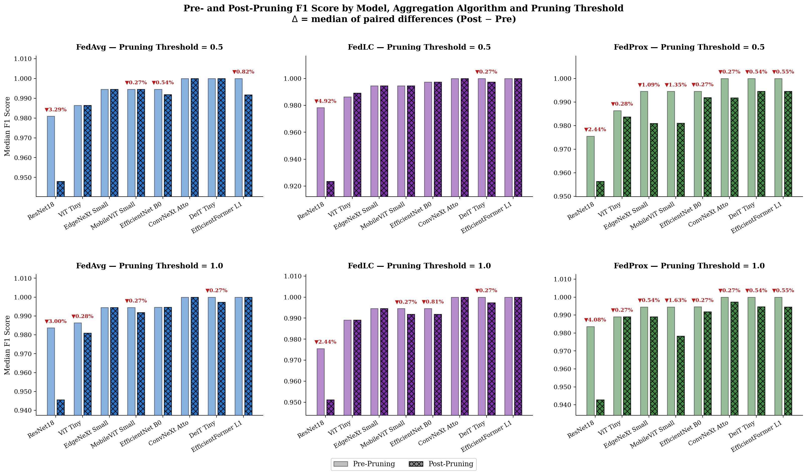

# An Efficient Federated Learning Method for Damaged Road Sign Detection in Smart Cities

## Introduction

**Road safety** is an increasingly important priority for public administrations worldwide. In this context, the proper maintenance of **vertical road signage** plays a crucial role. However, it becomes **costly and inefficient** when relying on traditional **manual inspection methods**. The **smart city paradigm**, combined with recent advances in **Artificial Intelligence (AI)**, offers new opportunities to **automate this process**.

This **project** proposes and evaluates a **distributed pipeline for road sign detection and classification**, optimized for **deployment on edge devices**. The architecture integrates **three main modules**:

- **Object Detection module (client-side)** – uses **lightweight YOLO models** to detect traffic signs.
- **Federated Learning module (server-side)** – coordinates the **distributed training of classifiers** that determine the **condition of the sign (damaged or healthy)**.
- **Data Pruning module (client-side)** – selects the **most informative samples** using **influence scores** computed on the **last layer of the global model**.

Experiments conducted on the **Mapillary Traffic Sign Dataset (MTSD)** show that **preliminary filtering of small bounding boxes** significantly improves the performance of lightweight models. 
In particular, **YOLO26s** achieves: **F1-score = 0.7214** compared to **0.6326** obtained **without filtering**. In the **Federated Learning setting**, three architectural families were evaluated:

- **Convolutional Neural Networks (CNN)**
- **Vision Transformers (ViT)**
- **Hybrid models (CNN + ViT)**

using different **aggregation strategies** and **pruning thresholds**. Among the tested models, **Vision Transformers (ViT)** emerge as the **best trade-off between computational efficiency, pruning robustness, and overall accuracy**. The results demonstrate that targeted **data pruning** can **reduce training time by up to 22%**, while maintaining **predictive performance within 2 percentage points**.

## Pipeline for Detection & Classification Road Signs

The system follows a **distributed pipeline** where **edge devices** and the **central server** collaboratively train the model using **Federated Learning**.

1. **Image Acquisition:** *Edge devices* capture images from the environment.

2. **Object Detection:** A *lightweight Object Detector* identifies *traffic signs* in the images.

3. **ROI Extraction & Preprocessing:** The detected *Regions of Interest (ROIs)* are extracted and processed through a *preprocessing stage*.

4. **Global Model Distribution:** The server sends the *updated global model* to the *edge devices*.

5. **Data Pruning:** Each device performs *data pruning* to select the *most informative samples* for training.

6. **Local Training:** Using *Federated Learning*, each device trains the classifier locally on its *pruned dataset*.

7. **Model Upload:** After local training rounds, model parameters are sent to the server.

8. **Aggregation:** The server *aggregates the parameters* to produce an *updated global model*.

9. **Model Redistribution:** The new global model is redistributed to the edge devices to repeat the training cycle.

## Data Pruning Module

The **data pruning module** is executed **locally on each client before training begins**
to remove **noisy, mislabeled, or redundant samples**, improving the convergence of the
**federated learning process**.

For each training sample $(x_i, y_i)$, an **influence score** is computed as the
**L2 norm of the gradient of the loss with respect to the last linear layer** of the model:

$$s_i = \left\| \nabla_{\theta_L} \mathcal{L}(f_\theta(x_i), y_i) \right\|_2$$

where $\theta_L$ includes both the **weights $W$** and **bias $b$** of the last layer,
concatenated into a single vector. This score quantifies how much the sample
**influences the model update**.

The scores are then **normalized per class using z-score normalization**:

$$z_i = \frac{s_i - \mu_c}{\sigma_c}$$

where $\mu_c$ and $\sigma_c$ are the mean and standard deviation of the influence scores
for class $c$. Only samples with **normalized scores within the threshold interval**
$z_i \in [-\varepsilon, +\varepsilon]$ are retained. This removes both:

- **High-gradient outliers** — potentially noisy or mislabeled samples
- **Low-gradient samples** — redundant or uninformative samples

A **class safeguard mechanism** ensures that **each class retains at least a minimum
number of samples**, reintegrating the most representative ones if necessary.

### Experimental Results on Training Time
The results reported in the table represent the **median time gain** aggregated across
all grid search configurations.
The data confirm a clear trend: **lower learning rates yield higher time savings**,
with **LR = 0.0001** consistently producing the largest gains across all models —
reaching up to **+17.5%** (MobileViT Small) and **+14.5%** (ViT Tiny).
At higher learning rates the benefit shrinks, and in some cases turns negative,
likely due to training instability in the post-pruning phase rather than a true
increase in computational cost.

### Experimental Results on F1-Score
In most cases, pruning introduces **negligible F1-score degradation (< 1%)** across
all aggregation algorithms and thresholds. The main exception is **ResNet18**, which
suffers the largest drops — up to **−4.92%** with FedLC at threshold 0.5 — consistent
with its higher dataset reduction rate. **FedProx** tends to amplify degradations
slightly, likely due to the interaction between its proximal regularization term and
the gradient-based pruning criterion.

